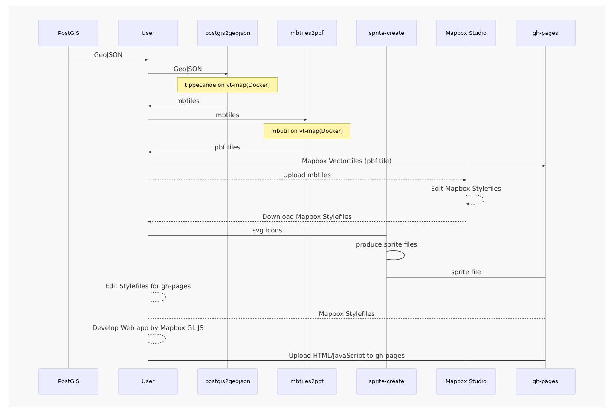

# awesome-narok-vector-tiles 
[](https://github.com/sindresorhus/awesome)
[](https://gitter.im/narwassco/community?utm_source=badge&utm_medium=badge&utm_campaign=pr-badge)

This is awesome implementations of the Mapbox Vector Tile for Narok Water

## Procedures
The procedures of creating vector tile map could be as follows.



## 1. Create mbtiles from PostGIS
- [watergis/postgis2mbtiles](https://github.com/watergis/postgis2mbtiles) : This module will create `mbtiles` by GeoJSON data which is retrieved from `PostGIS`.

First of all, you need to make SQL queries for each layer on [config.js](https://github.com/watergis/postgis2mbtiles/blob/master/test/config.js), so `postgis2geojson` tool will extract required data from PostGIS and a mbtiles will be created.

In the current setting, we have prepared following layers for `Narok Water and Sewerage Services Co., Ltd`.

|Layer|Geometry Type|Min Zoom|Max Zoom|Remarks|
|---|---|---|---|---|
|pipeline|LineString|10|18|It includes all the types of pipeline, but you may seperate by type of pipe such as main line or secondary line if necessary.|
|meter|Point|16|16|It only includes household connections.|
|flowmeter|Point|14|16|It only includes flow meters to cover wider range of zoom level than consumer meters.|
|valve|Point|15|16|eg. gate valve, sluice valve, air valve, non-return valve, etc.|
|firehydrant|Point|15|16|It's firehydrant layer|
|washout|Point|15|16|It's washout layer|
|tank|Polygon|13|16|Distribution tank layer as `Polygon`. However, you might need to change geometry type to `Point`|
|plant|Polygon|10|16|It incudes boundries of Water Treatment Plant and Water Intake|
|parcels|Polygon|16|16|It is polygon of parcels data which was provided by Narok town planning office.|
|parcels_annotation|Point|16|16|We seperated parcel number from other parcel data due to reducing the size of data.|
|village|Polygon|10|16|Narok water is zoning some area which is called `village`, you may change layer name for your company.|
|dma|Polygon|13|16|District Metered Area(DMA) for Non-Revenue Water Management|
|point_annotation|Point|10|16|We put all the annotation data here if we need to show some label.|

In Narok water, although we have a pumping station at the WTP, we don't have layer for pump. I know it is significant for a water company. So, you may need to add a layer for pumping station.

## 2. Design your Mapbox Style on Mapbox Studio
Next step is to design your own Mapbox Style on Mapbox Studio by using `mbtile` which was produced before.

You can use our [water-icons](https://github.com/narwassco/water-icons) for the purpose of designing your layers.

You may need to create an account of Mapbox Studio. Then, please keep your public accessToken as well. 

You can see official manual of Mapbox Studio [here](https://docs.mapbox.com/studio-manual/overview/).

## 3. Deploy Vector Tile to gh-pages
- [vt-map](https://github.com/narwassco/vt-map)
  This module will use the following submodules to create Mapbox Vector Tile for deployment to gh-pages.
  - [watergis/postgis2vectortiles](https://github.com/watergis/postgis2vectortiles): It creates `pbf(mvt)` from PostGIS.
  - [watergis/postgis2mbtiles](https://github.com/watergis/postgis2mbtiles): It creates `mbtiles` from PostGIS.
  - [watergis/mbtiles2pbf](https://github.com/watergis/mbtiles2pbf): It converts from `mbtiles` to `pbf(mvt)` tiles.

This module uses [tippecanoe](https://github.com/mapbox/tippecanoe) for producing mbtiles and uses [mbutil](https://github.com/mapbox/mbutil) to convert `mbtiles`. However, Narok water's GIS computer is Windows 10 Pro, so it is not easy to run `tippecanoe`, I developed `Docker` to create Mapbox Vector Tile.

## 4. Deploy Stylefiles and Sprite files to gh-pages
### Create Stylefiles
- [mapbox-stylefiles](https://github.com/narwassco/mapbox-stylefiles) : It manages our Mapbox Stylefiles and sprite files. Those Stylefiles will be published on gh-pages of this repository.

When you edit your own stylefile, you may download it from Mapbox Studio, then you can delete unnecessary contents from the stylefile, and changed url of `vector tile` and `sprite file` on it.

### Create Sprite files
- [sprite-creator](https://github.com/watergis/sprite-creator) : This module will create sprite file from particular icons, and it was intergrated in [mapbox-stylefiles](https://github.com/narwassco/mapbox-stylefiles) repository. The module will generate sprite files under the same direcotory of stylefiles.

    the following repositories manage our icons which are being used in our style files.
  - [water-icons](https://github.com/narwassco/water-icons) : It includes our own customized icon for water assets.
  - [mapbox-street-icons](https://github.com/narwassco/mapbox-street-icons) : It includes icons of Mapbox Street style and customized `water-icons`.
  - [mapbox-satellite-icons](https://github.com/narwassco/mapbox-satellite-icons):It includes icons of Mapbox Satellite style and customized `water-icons`.

After creating your own stylefiles and sprite files, you can deploy them to gh-pages.

## 5. Develop and Deploy Web Application
- [mapbox-gl-js-client](https://github.com/narwassco/mapbox-gl-js-client) : It is an web application which is using [Mapbox GL JS](https://docs.mapbox.com/mapbox-gl-js/api/). 

We have already performed the website, so you just edit [config.js](https://github.com/narwassco/mapbox-gl-js-client/blob/master/src/config.js) and build the application. Eventually, deploy it to gh-pages. [This](https://narok.water-gis.com) is our vector tile application. Let me know if you have some ideas or feedbacks.

We are using customer domain. So please make sure to delete `CNAME` file from the repository before deploying.

Also you can delete our source code related Google Analytics in `index.html` if you don't use it. Or you can change tracking ID to be yours.

## 6. Update Vector Tile data on gh-pages frequently
### Use Task Scheduler of Windows
`create_vt.bat` under `vt-map` module is a batch file for updating your vector tiles and deploy to gh-pages.

You can use `Task Scheduler` app in Windows to create a task to launch `create_vt.bat` in daily-basis or weekly-basis. So your GIS computer can update vectortiles data automatically and frequently.

`create_vt.bat` has the following scripts. Please change first row to be your installed directory.
```
cd C:\docker\vt-map  # change directory path for yours
git pull origin master
docker-compose up
npm run deploy
```

---
Documented by Jin IGARASHI <br>
©Narok Water and Sewerage Services Co.,Ltd.
