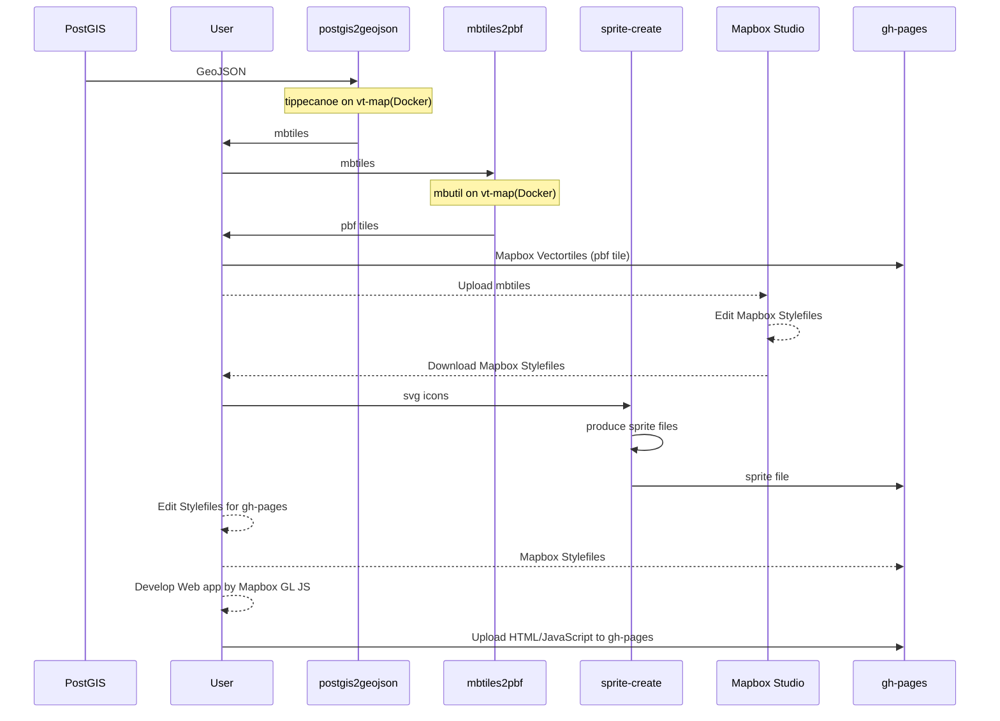

```mermaid
sequenceDiagram
    participant db as PostGIS
    participant x as User
    participant a as postgis2geojson
    participant b as mbtiles2pbf
    participant c as sprite-create
    participant y as Mapbox Studio
    participant z as gh-pages
    db->>a: GeoJSON
    Note over a: tippecanoe on vt-map(Docker)
    a->>x: mbtiles
    x->>b: mbtiles
    Note over b: mbutil on vt-map(Docker)
    b->>x: pbf tiles
    x->>z: Mapbox Vectortiles (pbf tile) 
    x-->>y: Upload mbtiles
    y-->>y: Edit Mapbox Stylefiles
    y-->>x: Download Mapbox Stylefiles
    x->>c: svg icons
    c->>c: produce sprite files
    c->>z: sprite file
    x-->>x: Edit Stylefiles for gh-pages
    x-->>z: Mapbox Stylefiles
    x-->>x: Develop Web app by Mapbox GL JS
    x->>z: Upload HTML/JavaScript to gh-pages
```
